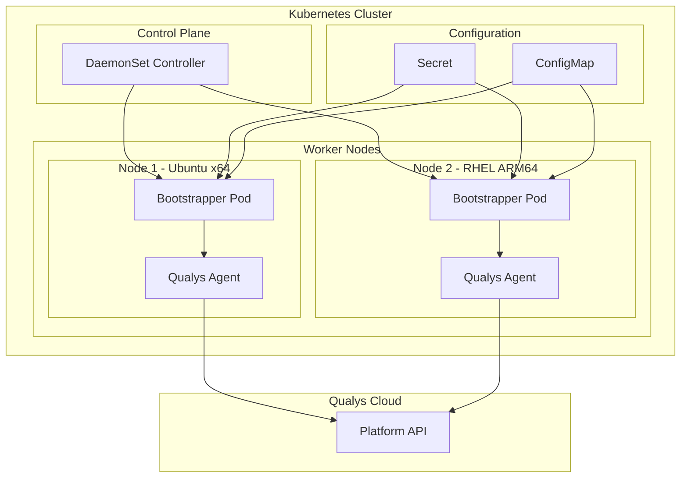
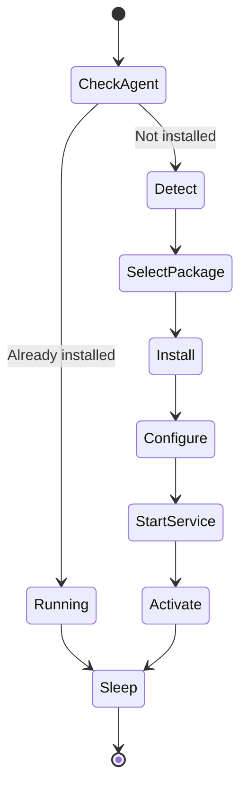
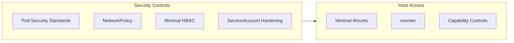

# Qualys Cloud Agent Helm Chart

[](https://artifacthub.io/packages/search?repo=qualys-ca)

Helm chart for deploying Qualys Cloud Agent on Kubernetes worker nodes using the bootstrapper model.

## Architecture



## Features

- **Host Installation**: Installs Qualys Cloud Agent directly on worker nodes
- **Multi-Architecture**: Supports x86_64 and ARM64 nodes
- **Universal OS Support**: Ubuntu, Debian, RHEL, CentOS, Amazon Linux, CoreOS
- **Secure**: NetworkPolicy, Pod Security Standards, credentials never logged
- **Idempotent**: Safe to redeploy, restart, or scale

## Prerequisites

- Kubernetes 1.19+
- Helm 3.0+
- Qualys subscription with activation ID and customer ID

## Installation

### Quick Start

```bash
helm repo add qualys https://nelssec.github.io/qualys-ca-helm
helm repo update

helm install qualys-agent qualys/qualys-ca \
  --namespace qualys \
  --create-namespace \
  --set credentials.activationId="YOUR_ACTIVATION_ID" \
  --set credentials.customerId="YOUR_CUSTOMER_ID" \
  --set config.serverUri="https://qagpublic.qg1.apps.qualys.com/CloudAgent/"
```

### From Source

```bash
git clone https://github.com/nelssec/qualys-ca-helm.git
cd qualys-ca-helm

helm install qualys-agent ./charts/qualys-ca \
  --namespace qualys \
  --create-namespace \
  --set credentials.activationId="YOUR_ACTIVATION_ID" \
  --set credentials.customerId="YOUR_CUSTOMER_ID" \
  --set config.serverUri="https://qagpublic.qg1.apps.qualys.com/CloudAgent/"
```

### Using Existing Secret

```bash
# Create secret first
kubectl create namespace qualys
kubectl create secret generic qualys-credentials \
  --namespace qualys \
  --from-literal=ACTIVATION_ID="YOUR_ACTIVATION_ID" \
  --from-literal=CUSTOMER_ID="YOUR_CUSTOMER_ID"

# Install with existing secret
helm install qualys-agent ./charts/qualys-ca \
  --namespace qualys \
  --set credentials.existingSecret="qualys-credentials" \
  --set config.serverUri="https://qagpublic.qg1.apps.qualys.com/CloudAgent/"
```

## Configuration

| Parameter | Description | Default |
|-----------|-------------|---------|
| `image.repository` | Container image | `nelssec/qualys-agent-bootstrapper` |
| `image.tag` | Image tag | `v2.0.0` |
| `image.pullPolicy` | Pull policy | `IfNotPresent` |
| `credentials.activationId` | Qualys Activation ID | `""` |
| `credentials.customerId` | Qualys Customer ID | `""` |
| `credentials.existingSecret` | Use existing secret | `""` |
| `config.serverUri` | Qualys platform endpoint | `""` |
| `config.logLevel` | Log verbosity (0-5) | `"3"` |
| `networkPolicy.enabled` | Enable NetworkPolicy | `true` |
| `priorityClassName` | Pod priority class | `system-node-critical` |
| `resources.requests.cpu` | CPU request | `100m` |
| `resources.requests.memory` | Memory request | `128Mi` |
| `resources.limits.cpu` | CPU limit | `500m` |
| `resources.limits.memory` | Memory limit | `512Mi` |
| `nodeSelector` | Node selector | `kubernetes.io/os: linux` |
| `tolerations` | Pod tolerations | Tolerates all taints |

## Qualys Platform Endpoints

| Region | Server URI |
|--------|------------|
| US Platform 1 | `https://qagpublic.qg1.apps.qualys.com/CloudAgent/` |
| US Platform 2 | `https://qagpublic.qg2.apps.qualys.com/CloudAgent/` |
| US Platform 3 | `https://qagpublic.qg3.apps.qualys.com/CloudAgent/` |
| EU Platform 1 | `https://qagpublic.qg1.apps.qualys.eu/CloudAgent/` |
| EU Platform 2 | `https://qagpublic.qg2.apps.qualys.eu/CloudAgent/` |
| India | `https://qagpublic.qg1.apps.qualys.in/CloudAgent/` |
| Canada | `https://qagpublic.qg1.apps.qualys.ca/CloudAgent/` |
| Australia | `https://qagpublic.qg1.apps.qualys.com.au/CloudAgent/` |

Find your platform: https://www.qualys.com/platform-identification/

## How It Works



1. **DaemonSet deploys** a bootstrapper pod on each Linux node
2. **Pod detects** host OS (Ubuntu, RHEL, etc.) and architecture (x64, ARM64)
3. **Selects package** (DEB or RPM) matching the host
4. **Installs agent** on the host using nsenter
5. **Configures** agent with credentials from Kubernetes secrets
6. **Starts service** and verifies activation
7. **Pod sleeps** while agent runs on host

## Security



### CIS Benchmark Compliance

| Control | Implementation |
|---------|---------------|
| **5.1.3** - ServiceAccount token mount | `automountServiceAccountToken: false` |
| **5.1.5** - Default ServiceAccount | Dedicated ServiceAccount per deployment |
| **5.2.1** - Privileged containers | Required for host installation (documented) |
| **5.2.7** - Capability restrictions | Drops ALL, adds only SYS_ADMIN, SYS_CHROOT, SYS_PTRACE |
| **5.2.8** - HostPID | Required for nsenter (documented) |
| **5.3.1** - NetworkPolicy | Egress restricted to 443/TCP and 53/UDP,TCP |

### Security Features

- **Pod Security Standards**: Namespace enforces `privileged` PSS
- **NetworkPolicy**: Egress restricted to HTTPS (443) and DNS (53) only
- **Immutable Secrets**: Credentials stored as immutable secrets
- **Minimal Mounts**: Specific paths only, not full filesystem
- **Credentials Protected**: Never logged, config files mode 600
- **RBAC**: Read-only access to nodes and pods only
- **Priority Class**: `system-node-critical` ensures security agent runs
- **Capability Drop**: Drops ALL capabilities, adds only required ones

## Verify Installation

```bash
# Check DaemonSet
kubectl get daemonset -n qualys

# Check pods
kubectl get pods -n qualys -o wide

# View logs
kubectl logs -n qualys -l app.kubernetes.io/name=qualys-ca

# Check agent on host
kubectl exec -n qualys <pod-name> -- \
  nsenter --target 1 --mount --uts --ipc --net --pid -- \
  systemctl status qualys-cloud-agent
```

## Upgrade

```bash
helm upgrade qualys-agent ./charts/qualys-ca \
  --namespace qualys \
  --reuse-values \
  --set image.tag=v2.1.0
```

## Uninstall

```bash
helm uninstall qualys-agent --namespace qualys
kubectl delete namespace qualys
```

**Note**: Uninstalling the Helm chart does not remove the Qualys agent from nodes. The agent persists on the host.

## Troubleshooting

| Issue | Solution |
|-------|----------|
| Pod pending | Check node selector and taints |
| CrashLoopBackOff | Verify credentials secret exists |
| Agent not activating | Check Server URI matches your platform |
| Permission denied | Verify privileged security context |

### Debug Commands

```bash
# Describe pod
kubectl describe pod -n qualys <pod-name>

# View logs
kubectl logs -n qualys <pod-name> --timestamps

# Shell into pod
kubectl exec -it -n qualys <pod-name> -- /bin/bash

# Check host agent
kubectl exec -n qualys <pod-name> -- \
  nsenter --target 1 --mount --uts --ipc --net --pid -- \
  journalctl -u qualys-cloud-agent --no-pager -n 50
```

## Support

- GitHub Issues: https://github.com/nelssec/qualys-ca-helm/issues
- Qualys Support: https://www.qualys.com/support/

## License

Apache-2.0

## Maintainers

- Andrew Nelson (anelson@qualys.com)
