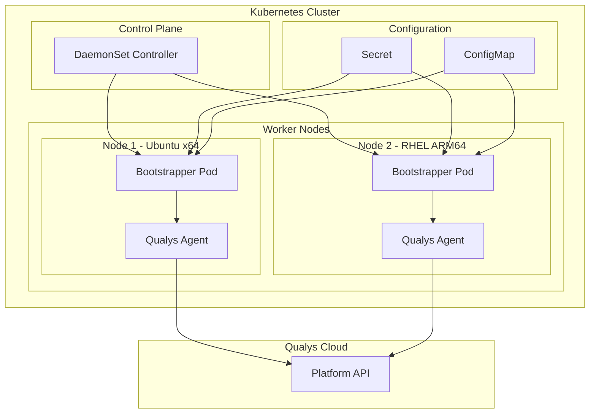
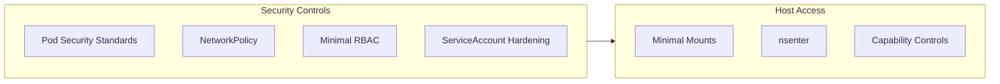
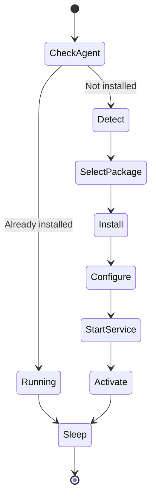

# Streamlining Kubernetes Security: Qualys Cloud Agent Helm Chart for Node Protection

**Author:** Andrew Nelson, Senior Security Solutions Architect, Qualys

**Read Time:** 6 minutes

## Overview

Organizations deploying Kubernetes face unique challenges in maintaining security visibility across their worker nodes. Traditional approaches to deploying security agents in containerized environments often fall short. They either require manual intervention on each node or run agents inside containers that lack the necessary access to detect host-level vulnerabilities. The Qualys Cloud Agent Helm Chart delivers a solution that automatically installs and configures the Cloud Agent directly on Kubernetes worker nodes, providing visibility and protection without operational overhead.

## Architecture



## Key Security Challenges in Kubernetes Environments

Organizations transitioning to Kubernetes face three primary obstacles when deploying security agents:

### Manual Deployment Complexity

Installing security agents across dynamic, auto-scaling Kubernetes clusters requires significant operational effort. Nodes come and go, and manual installation processes cannot keep pace with the ephemeral nature of cloud-native infrastructure.

### Container Isolation Limitations

Running security agents inside containers restricts their ability to assess host-level vulnerabilities. Container isolation, while beneficial for application security, prevents agents from gaining the visibility needed to detect OS-level misconfigurations and vulnerabilities.

### Multi-Architecture Environments

Modern Kubernetes clusters often span multiple architectures, including x86_64 and ARM64 nodes. Consistent security coverage across heterogeneous infrastructure demands a solution that automatically adapts to each node's architecture and operating system.

## How Qualys Addresses Kubernetes Security Challenges

The Qualys Cloud Agent Helm Chart introduces a bootstrapper model that solves these challenges. Rather than running the agent inside a container, the Helm chart deploys a DaemonSet that installs the Qualys Cloud Agent directly on each worker node's host operating system.

### Automated Host-Level Installation

The bootstrapper pod automatically detects the host operating system (Ubuntu, Debian, RHEL, CentOS, Amazon Linux, CoreOS) and architecture (x86_64, ARM64), then selects and installs the appropriate agent package.

This approach provides:

- Zero manual intervention with automatic installation on new nodes as they join the cluster
- Full access to OS-level security telemetry through host-level agent execution
- Support for major Linux distributions and both x86_64 and ARM64 architectures

### Helm Deployment

Deploying the Qualys Cloud Agent across your entire Kubernetes cluster requires just a few commands:

```bash
helm repo add qualys https://nelssec.github.io/qualys-ca-helm
helm repo update

helm install qualys-agent qualys/qualys-ca \
  --namespace qualys \
  --create-namespace \
  --set credentials.activationId="YOUR_ACTIVATION_ID" \
  --set credentials.customerId="YOUR_CUSTOMER_ID" \
  --set config.serverUri="https://qagpublic.qg1.apps.qualys.com/CloudAgent/"
```

### Security Controls

The Helm chart incorporates security best practices aligned with CIS Kubernetes Benchmark recommendations:



| Control | Implementation |
|---------|----------------|
| NetworkPolicy | Egress restricted to HTTPS (443) and DNS (53) only |
| Secrets | Stored as immutable Kubernetes secrets |
| RBAC | Read-only access to nodes and pods |
| Credentials | Never logged; configuration files set to mode 600 |
| Pod Security | Namespace labels enforce privileged Pod Security Standards |

## Understanding the Bootstrapper Model

The Qualys Cloud Agent Helm Chart employs a bootstrapper model that bridges Kubernetes orchestration and host-level security.



### Installation Flow

1. Helm deploys a DaemonSet ensuring one bootstrapper pod runs on each Linux node
2. The bootstrapper detects the node's operating system and architecture
3. The appropriate package format (DEB or RPM) is selected based on the host OS
4. Using nsenter, the bootstrapper installs the agent directly on the host filesystem
5. Credentials from Kubernetes secrets configure the agent without exposure
6. The agent service starts and registers with the Qualys platform
7. The pod enters a sleep state while the host agent provides ongoing security coverage

### Key Characteristics

The bootstrapper model provides several operational benefits:

- Idempotent operations allow safe redeployment, restart, or scaling without duplicate installations
- The agent persists on nodes even if the Helm release is removed
- The `system-node-critical` priority class ensures security agents run reliably

## Key Takeaway

The Qualys Cloud Agent Helm Chart combines Helm's declarative deployment model with a bootstrapper approach that installs agents directly on host nodes. Organizations can achieve security visibility across their Kubernetes infrastructure without manual intervention. Multi-architecture support, security hardening, and integration with the Qualys platform enable security teams to protect containerized environments at scale.

## Get Started Today

### Current Qualys Subscribers

Deploy the Qualys Cloud Agent across your Kubernetes clusters:

```bash
helm repo add qualys https://nelssec.github.io/qualys-ca-helm
helm install qualys-agent qualys/qualys-ca --namespace qualys --create-namespace
```

For installation instructions and configuration options, visit the [Qualys Cloud Agent Helm Chart repository](https://github.com/nelssec/qualys-ca-helm).

### New to Qualys

Contact your Qualys representative or visit [qualys.com](https://www.qualys.com) to learn more about the Qualys Cloud Platform and request a trial.

## Resources

- [GitHub Repository](https://github.com/nelssec/qualys-ca-helm)
- [Artifact Hub](https://artifacthub.io/packages/helm/qualys-ca/qualys-ca)
- [Qualys Platform Identification](https://www.qualys.com/platform-identification/)
