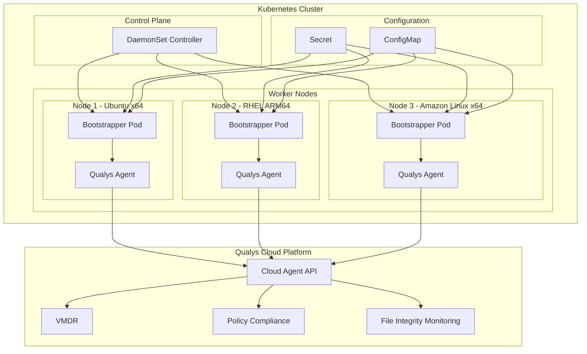
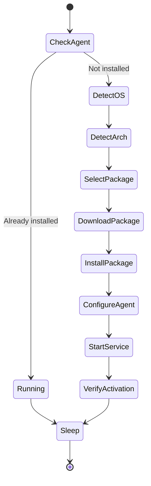
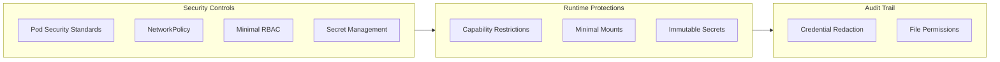

# Streamlining Kubernetes Security: Qualys Cloud Agent Helm Chart for Automated Node Protection

**Author:** Andrew Nelson, Senior Security Solutions Architect, Qualys

**Read Time:** 11 minutes

## Overview

As organizations embrace Kubernetes as the foundation for their containerized workloads, they encounter a fundamental security challenge that many traditional approaches struggle to address. Worker nodes, the compute infrastructure that runs containerized applications, require the same rigorous vulnerability management and compliance monitoring that organizations apply to their traditional infrastructure. Yet the dynamic, ephemeral nature of Kubernetes environments makes deploying and maintaining security agents significantly more complex than in conventional data centers. This complexity often forces security teams into difficult tradeoffs, choosing between incomplete visibility from containerized agents, manual installation processes that cannot keep pace with infrastructure changes, or investing significant engineering resources into custom automation pipelines.

With the release of the Qualys Cloud Agent Helm Chart, organizations now have access to a solution that eliminates these tradeoffs entirely. By leveraging a bootstrapper model that automatically installs and configures the Qualys Cloud Agent directly on Kubernetes worker nodes, this Helm chart delivers comprehensive host-level visibility without requiring manual intervention or custom automation development. This approach represents a fundamental advancement in how organizations can secure their Kubernetes infrastructure, combining the operational simplicity that Helm provides with the comprehensive security capabilities of the Qualys Cloud Platform. In this blog, we will examine the specific security challenges that organizations face when deploying agents in Kubernetes environments and demonstrate how the Qualys Cloud Agent Helm Chart delivers unmatched visibility, operational efficiency, and security hardening to protect containerized infrastructure at scale.

## The Kubernetes Security Visibility Gap

Before examining the solution in detail, it is essential to understand why traditional agent deployment methods consistently fall short when applied to Kubernetes environments. The challenges organizations face are not merely operational inconveniences but fundamental limitations that can leave critical security gaps in containerized infrastructure.

### The Container Isolation Problem

The predominant approach that security vendors have adopted involves running their agents inside containers, deploying them as DaemonSets or similar Kubernetes primitives. While this approach offers the advantage of simplified deployment through standard Kubernetes mechanisms, it introduces a fundamental limitation that undermines the core purpose of host-level security monitoring. Container isolation, the very mechanism that provides valuable security boundaries for applications, simultaneously prevents security agents from accessing the host-level resources they need to perform comprehensive vulnerability assessment and compliance monitoring.

Containerized agents operate within the constraints of their container runtime environment. They cannot enumerate processes running directly on the host, inspect kernel modules that may contain vulnerabilities, audit system configurations outside their container namespace, or detect vulnerabilities affecting the underlying operating system and its packages. This limitation represents far more than a minor gap in coverage. When critical vulnerabilities emerge that affect container runtimes or host operating systems, such as CVE-2024-21626, commonly known as Leaky Vessels, which affected container runtimes at the host level, organizations relying on containerized security agents may discover that their security solution lacks the access required to detect the vulnerability or verify that remediation has been successfully applied. The security tools that organizations depend upon to protect their infrastructure reveal blind spots precisely when comprehensive visibility matters most.

### The Manual Deployment Burden

Organizations that recognize the limitations of containerized agents often turn to traditional deployment methods: installing agents directly on nodes through configuration management tools, incorporating agents into golden images, or performing manual installation procedures. Each of these approaches carries substantial operational overhead that creates friction between security requirements and infrastructure agility.

Configuration management tools such as Ansible, Puppet, or Chef require organizations to maintain separate automation infrastructure that operates alongside their Kubernetes environment. Security teams must invest significant effort coordinating with platform engineering teams to integrate agent deployment into existing configuration management workflows. They must manage credentials that provide access to node operating systems, handle the complexity of heterogeneous node configurations across different Linux distributions and architectures, and maintain synchronization between configuration management state and the actual state of the Kubernetes cluster as nodes are added, removed, or replaced.

Golden image approaches embed the security agent into node images during the image build process, ensuring that every node launched from the image includes the agent. This method functions effectively until the agent requires updates to address new vulnerabilities, incorporate new detection capabilities, or resolve operational issues. At that point, organizations must rebuild their node images, update their node pool configurations to reference the new images, and coordinate rolling replacements across production clusters that may span hundreds or thousands of nodes. The elapsed time between when Qualys releases an agent update and when that update reaches all nodes in production can extend to weeks, leaving organizations exposed to threats that updated agents would detect.

Manual installation, while conceptually straightforward, simply does not scale to meet the demands of modern Kubernetes environments. A security team that can successfully maintain agents across a handful of nodes cannot possibly keep pace with auto-scaling clusters that dynamically add and remove nodes based on workload demand, sometimes launching dozens of new nodes within minutes during traffic spikes or batch processing windows.

### The Architecture Fragmentation Challenge

Modern Kubernetes deployments increasingly span multiple processor architectures, adding another dimension of complexity to agent deployment. Organizations run x86_64 nodes for general-purpose workloads while simultaneously deploying ARM64 nodes for cost optimization, improved power efficiency, or specialized compute requirements. All major cloud providers now offer ARM-based node pools in their managed Kubernetes services, often at substantially reduced costs compared to equivalent x86_64 instances, which drives rapid adoption of mixed-architecture clusters.

Security agents must provide appropriate packages for both architectures, and the deployment automation must correctly identify each node's architecture and install the corresponding package variant. Organizations that rely on manual deployment methods must develop and maintain separate installation procedures for each architecture, effectively doubling the operational burden of agent lifecycle management. Many security vendors have been slow to develop ARM64 support for their agents, leaving organizations with the unpalatable choice of accepting incomplete security coverage or constraining their architecture decisions based on security tooling limitations rather than workload requirements.

## Why Existing Approaches Fall Short

Organizations have invested considerable effort developing workarounds to address these challenges, but each approach introduces its own set of limitations that ultimately prevent it from delivering the comprehensive, automated security coverage that Kubernetes environments require.

### Privileged DaemonSets Without Host Installation

Some security vendors deploy privileged containers that mount portions of the host filesystem and attempt to perform security scanning from within the container context. While this approach provides greater visibility into the host than standard containerized agents, it remains fundamentally constrained by container runtime limitations. The agent process executes within the container's process namespace, which limits its ability to monitor host-level system events, integrate with systemd or other init systems, or function as a proper system service that persists across container restarts.

These solutions also introduce security considerations that organizations must carefully evaluate. A privileged container with extensive host filesystem access represents an attractive target for attackers who have gained initial access to the Kubernetes environment. If such a container is compromised, it provides attackers with direct access to host resources without the security controls and audit capabilities that a properly installed host agent would provide. Organizations must weigh the operational convenience of containerized deployment against the security implications of running privileged containers with broad host access.

### Sidecar and Init Container Patterns

Some organizations have explored sidecar patterns that run security agents as additional containers within application pods. While sidecar containers can provide valuable application-level security capabilities such as runtime protection or network monitoring, they do nothing to address the fundamental need for node-level visibility. The security agent running as a sidecar can only observe activity within its pod's namespace and has no visibility into the underlying host operating system, other pods running on the same node, or system-level processes and configurations. Organizations that adopt sidecar approaches for application security still require a separate solution for host security, resulting in multiple agents from potentially different vendors, multiple management consoles, and fragmented security operations that increase complexity and reduce efficiency.

Init container patterns attempt to address node-level security by running installation logic before the main application container starts. The init container installs the agent, then exits, allowing the main container to run with the agent present on the host. However, this approach faces significant timing and reliability challenges in practice. Init containers must complete successfully before the pod can transition to the running state, but agent installation involves downloading packages, executing installation scripts, configuring the agent with credentials, and starting the agent service. Any failure in this sequence, whether due to network issues, package repository unavailability, or configuration errors, blocks pod startup entirely. This behavior creates availability concerns that discourage adoption, particularly for critical workloads where pod startup delays directly impact application availability.

### Third-Party Automation Pipelines

Some organizations with strong platform engineering capabilities have developed custom automation to deploy security agents using Kubernetes operators, GitOps workflows, or custom controllers. While technically feasible, this approach demands substantial engineering investment that most organizations would prefer to direct toward their core business objectives rather than security tooling infrastructure.

Building robust agent deployment automation requires handling numerous edge cases that only become apparent through operational experience. The automation must correctly detect node operating systems across multiple Linux distributions, each with different package managers and installation conventions. It must handle architecture detection and package selection for both x86_64 and ARM64 nodes. It must manage the lifecycle of agents as nodes are replaced, upgraded, or cordoned for maintenance. It must gracefully handle transient failures in package downloads or service startup. And it must accomplish all of this while maintaining the security posture that production environments demand.

This engineering burden diverts resources from activities that directly improve security outcomes. Instead of analyzing vulnerability findings, investigating potential threats, or refining security policies, teams spend their time debugging deployment automation edge cases and maintaining custom code that provides no differentiated value compared to a purpose-built solution.

## The Qualys Solution: Helm-Based Bootstrapper Model

The Qualys Cloud Agent Helm Chart takes a fundamentally different approach to solving the Kubernetes agent deployment challenge. Rather than running the agent inside a container where it lacks host visibility, or requiring organizations to build custom automation, the Helm chart deploys a bootstrapper component that installs the Qualys Cloud Agent directly on the host operating system while leveraging standard Kubernetes primitives for orchestration and lifecycle management.



This architecture combines the deployment automation benefits of Kubernetes with the comprehensive visibility of host-level agent installation, eliminating the tradeoffs that have historically forced organizations to choose between operational simplicity and security coverage.

### How the Bootstrapper Model Works

The Helm chart deploys a DaemonSet that schedules a bootstrapper pod on each Linux node in the cluster. Unlike approaches that run the security agent inside a container, the bootstrapper serves a singular purpose: installing and configuring the Qualys Cloud Agent on the host operating system, then stepping aside while the host-level agent provides ongoing security coverage.



When the bootstrapper pod starts on a node, it first determines whether the Qualys Cloud Agent is already present on the host. If the agent is already installed and running, the bootstrapper simply enters a sleep state, consuming minimal resources while the host agent continues its security monitoring activities. This idempotent behavior ensures that redeploying the Helm chart, restarting pods, or scaling the DaemonSet does not result in duplicate installations or configuration conflicts.

If the agent is not present, the bootstrapper proceeds through a comprehensive installation sequence. It begins by detecting the host operating system, distinguishing between distributions that use DEB packages (Ubuntu, Debian) and those that use RPM packages (Red Hat Enterprise Linux, CentOS, Amazon Linux, Fedora CoreOS, SUSE). It then identifies the host architecture, determining whether to install x86_64 or ARM64 package variants. Based on this detection, it selects and downloads the appropriate Qualys Cloud Agent package.

The bootstrapper uses nsenter to execute installation commands directly in the host namespace, ensuring that the agent is installed on the host filesystem rather than within the container. It configures the agent with credentials obtained from Kubernetes secrets, setting appropriate file permissions to protect sensitive configuration data. It starts the agent service through the host's init system and verifies successful activation with the Qualys Cloud Platform before entering its sleep state.

This approach delivers the security benefits of proper host-level agent installation while leveraging Kubernetes for deployment automation, giving organizations the best of both worlds.

### Automatic Scaling and Node Discovery

One of the most compelling advantages of the bootstrapper model is its ability to scale automatically with infrastructure changes. When Kubernetes adds nodes to the cluster, whether through cluster autoscaler responding to increased workload demand, manual node pool expansion, or node replacement during upgrades, the DaemonSet controller automatically schedules bootstrapper pods on the new nodes. The agent installation process runs without requiring any manual intervention from security or operations teams.

This automatic scaling ensures that security coverage expands in lockstep with infrastructure growth. Organizations no longer face the operational challenge of discovering new nodes and initiating agent installation before workloads begin running. From the moment a node joins the cluster and the bootstrapper pod completes its installation sequence, the node benefits from full Qualys Cloud Agent coverage.

When nodes are removed from the cluster, the agent installed on the host continues running until the node itself is terminated. There is no gap in security coverage during the node lifecycle transition, and no risk that workloads running during the node's final minutes of operation escape security monitoring.

### Universal Distribution Support

The bootstrapper incorporates comprehensive package detection and installation logic that handles the diversity of Linux distributions commonly deployed in Kubernetes environments. Organizations running heterogeneous clusters with multiple Linux distributions receive consistent agent deployment across all nodes without requiring distribution-specific configuration or automation.

| Distribution | Package Format | Architectures |
|--------------|----------------|---------------|
| Ubuntu | DEB | x86_64, ARM64 |
| Debian | DEB | x86_64, ARM64 |
| Red Hat Enterprise Linux | RPM | x86_64, ARM64 |
| CentOS | RPM | x86_64, ARM64 |
| Amazon Linux | RPM | x86_64, ARM64 |
| Fedora CoreOS | RPM | x86_64, ARM64 |
| SUSE Linux Enterprise | RPM | x86_64, ARM64 |

This universal distribution support means organizations can make infrastructure decisions based on workload requirements, cost optimization, or operational preferences rather than security tooling constraints. Whether a cluster runs entirely on Ubuntu, mixes Amazon Linux and CoreOS nodes, or spans multiple distributions for different node pools, the Qualys Cloud Agent Helm Chart provides consistent, automated coverage.

## Security Architecture

The Qualys Cloud Agent Helm Chart incorporates security controls aligned with CIS Kubernetes Benchmark recommendations and defense-in-depth principles. While the bootstrapper requires elevated privileges to install software on the host, the Helm chart applies security hardening throughout its design to minimize risk and maintain a strong security posture.



### Network Isolation

The Helm chart deploys a NetworkPolicy resource that strictly limits the network communications permitted for bootstrapper pods. Egress traffic is restricted to only the destinations essential for agent operation:

- HTTPS connections on TCP port 443 for communication with the Qualys Cloud Platform
- DNS queries on UDP and TCP port 53 for name resolution

All other outbound network traffic is denied by default. This restriction significantly limits the potential impact if a bootstrapper container were somehow compromised, preventing lateral movement to other services within the cluster or data exfiltration to unauthorized external destinations. The NetworkPolicy provides an additional layer of defense that complements the other security controls implemented in the Helm chart.

### Credential Protection

The Qualys activation credentials required for agent configuration, specifically the Activation ID and Customer ID, receive multiple layers of protection throughout the deployment lifecycle. Credentials are stored in Kubernetes secrets that are explicitly marked as immutable, preventing modification after creation and ensuring that any attempt to tamper with credentials requires deleting and recreating the secret rather than subtle in-place modifications that might escape notice.

The bootstrapper reads credential values from mounted secret volumes and writes them to agent configuration files on the host with mode 600 permissions. This permission setting ensures that only the root user can read the configuration files containing credentials, protecting them from access by other processes or users on the host.

Critically, credential values are never written to logs or standard output. The bootstrapper explicitly redacts sensitive values from all output, preventing credential exposure through container logs that might be aggregated to centralized logging systems or Kubernetes events that might be visible to users with limited cluster permissions.

### Minimal Privilege Implementation

While the bootstrapper necessarily requires privileged access to install software on the host operating system, the Helm chart follows least-privilege principles rigorously in all other aspects of its design:

| Control | Implementation |
|---------|----------------|
| ServiceAccount Token | Automount explicitly disabled on both the ServiceAccount and Pod specifications |
| RBAC Permissions | Read-only access to nodes and pods for metadata collection; no write permissions |
| Linux Capabilities | Drops ALL capabilities, then adds only SYS_ADMIN, SYS_CHROOT, and SYS_PTRACE |
| Host Networking | Explicitly disabled; bootstrapper uses standard pod networking |
| Host Filesystem | Mounts only specific required paths rather than the entire host filesystem |

These controls ensure that even though the bootstrapper operates with elevated privileges for its installation function, it does not possess unnecessary permissions that could be exploited if the container were compromised.

### Pod Security Standards

The namespace that the Helm chart creates includes labels that enforce Pod Security Standards at the privileged level. This configuration is required for the bootstrapper to access the host resources necessary for agent installation. Importantly, these permissive security standards apply only to the dedicated Qualys namespace and do not affect Pod Security Standard enforcement in other namespaces throughout the cluster. Organizations can maintain restrictive Pod Security Standards for application workloads while allowing the necessary privileges for security infrastructure in its isolated namespace.

## Deployment

Installing the Qualys Cloud Agent across an entire Kubernetes cluster requires only minimal configuration. The Helm chart handles the complexity of multi-distribution support, architecture detection, credential management, and security hardening automatically.

### Quick Start

Organizations can deploy the Qualys Cloud Agent across their Kubernetes clusters with a few commands:

```bash
helm repo add qualys https://nelssec.github.io/qualys-ca-helm
helm repo update

helm install qualys-agent qualys/qualys-ca \
  --namespace qualys \
  --create-namespace \
  --set credentials.activationId="YOUR_ACTIVATION_ID" \
  --set credentials.customerId="YOUR_CUSTOMER_ID" \
  --set config.serverUri="YOUR_PLATFORM_URL"
```

The Helm chart creates the namespace, deploys all required resources including the DaemonSet, secrets, ConfigMap, NetworkPolicy, and RBAC resources, and begins agent installation across all Linux nodes in the cluster.

### Using Existing Secrets

Organizations that prefer to manage secrets through existing workflows, such as external secret management systems or GitOps pipelines that create secrets separately from Helm releases, can reference pre-created secrets:

```bash
kubectl create namespace qualys

kubectl create secret generic qualys-credentials \
  --namespace qualys \
  --from-literal=ACTIVATION_ID="YOUR_ACTIVATION_ID" \
  --from-literal=CUSTOMER_ID="YOUR_CUSTOMER_ID"

helm install qualys-agent qualys/qualys-ca \
  --namespace qualys \
  --set credentials.existingSecret="qualys-credentials" \
  --set config.serverUri="YOUR_PLATFORM_URL"
```

This flexibility allows the Helm chart to integrate smoothly with diverse operational workflows without imposing specific secret management patterns.

### Verification

After deployment, organizations can verify successful agent installation across all nodes:

```bash
# Check DaemonSet status to confirm pods are running on all nodes
kubectl get daemonset -n qualys

# View bootstrapper logs to observe installation progress
kubectl logs -n qualys -l app.kubernetes.io/name=qualys-ca

# Verify agent service status on a specific node
kubectl exec -n qualys <pod-name> -- \
  nsenter --target 1 --mount --uts --ipc --net --pid -- \
  systemctl status qualys-cloud-agent
```

Within minutes of deployment, nodes begin appearing in the Qualys Cloud Platform console with full vulnerability and compliance data.

## Integration with Qualys Cloud Platform

Once installed on Kubernetes worker nodes, Qualys Cloud Agents automatically connect to the Qualys Cloud Platform and begin providing security data. Organizations gain immediate access to the full range of Qualys security capabilities for their Kubernetes infrastructure.

### Vulnerability Management, Detection, and Response (VMDR)

Agents continuously report installed packages, running services, and system configuration to Qualys VMDR, enabling comprehensive vulnerability management:

- Continuous vulnerability assessment eliminates the delays inherent in scheduled scanning approaches
- Industry-leading six-hour detection SLA from CVE publication ensures rapid identification of emerging threats
- TruRisk scoring prioritizes vulnerabilities based on asset criticality, exploit availability, and active threat intelligence
- Integration with Qualys Patch Management enables automated remediation workflows that reduce mean time to remediation

### Policy Compliance

Agents evaluate system configurations against industry-standard compliance benchmarks and organizational policies:

- CIS Benchmarks for operating system hardening provide authoritative baseline configurations
- Custom policy definitions address organization-specific security requirements
- Continuous monitoring with drift detection identifies configuration changes that deviate from approved baselines
- Comprehensive evidence collection supports audit documentation requirements

### File Integrity Monitoring

Agents monitor critical files and directories for unauthorized modifications:

- Real-time change detection with event forwarding enables rapid incident response
- Baseline management tracks authorized configuration states across the infrastructure
- Native integration with SIEM and SOAR platforms through Qualys APIs extends FIM data into existing security workflows

## Technical Specifications

| Specification | Details |
|---------------|---------|
| Kubernetes Versions | 1.19 and later |
| Helm Versions | 3.0 and later |
| Supported Architectures | x86_64, ARM64 |
| Supported Operating Systems | Ubuntu, Debian, RHEL, CentOS, Amazon Linux, Fedora CoreOS, SUSE |
| Agent Version | Latest stable release |
| Update Strategy | Rolling update with configurable maxUnavailable |
| Resource Requests | 100m CPU, 128Mi memory |
| Resource Limits | 500m CPU, 512Mi memory |
| Priority Class | system-node-critical |

## Value Propositions

The Qualys Cloud Agent Helm Chart delivers measurable benefits across security, operations, and compliance functions, addressing the core challenges that have historically made Kubernetes security agent deployment difficult.

### Eliminate Deployment Complexity

Organizations can deploy comprehensive vulnerability management and compliance monitoring across their entire Kubernetes infrastructure with a single Helm command. There is no need to integrate with configuration management systems, no requirement to rebuild golden images when agents need updates, and no custom automation code to develop and maintain. The operational burden of agent deployment drops dramatically, freeing security and platform teams to focus on higher-value activities.

### Close the Host Visibility Gap

Unlike containerized agents that sacrifice host visibility for deployment convenience, the Qualys Cloud Agent runs directly on worker nodes as a proper system service. It has full access to enumerate host processes, inspect installed packages, audit system configurations, and monitor file integrity. Organizations gain the comprehensive visibility they need to identify vulnerabilities and compliance gaps across their entire infrastructure, including the container orchestration layer itself.

### Scale Automatically with Infrastructure

Agent deployment scales seamlessly with infrastructure changes. When cluster autoscaler adds nodes to handle increased workload, agents install automatically without manual intervention. When organizations expand their clusters for new projects or migrate workloads, security coverage extends in lockstep. Security teams can focus on analyzing findings and improving security posture rather than maintaining deployment automation.

### Unify Security Operations

Kubernetes worker nodes appear in the same Qualys console as traditional servers, cloud instances, and other infrastructure. Security teams use familiar VMDR workflows, dashboards, and reporting capabilities without learning new tools or managing separate consoles for containerized environments. This unified approach reduces operational complexity and ensures consistent security practices across hybrid infrastructure.

### Maintain Compliance Posture

Continuous agent-based assessment provides the evidence and documentation that compliance audits require. Organizations can demonstrate consistent security controls across dynamic Kubernetes environments where nodes may be replaced multiple times per day. Policy compliance monitoring, file integrity monitoring, and comprehensive vulnerability data combine to support PCI DSS, HIPAA, SOC 2, and other compliance frameworks.

## Get Started

### Current Qualys Subscribers

Organizations with existing Qualys subscriptions can deploy the Qualys Cloud Agent across their Kubernetes clusters immediately:

```bash
helm repo add qualys https://nelssec.github.io/qualys-ca-helm
helm install qualys-agent qualys/qualys-ca --namespace qualys --create-namespace
```

For detailed configuration options, deployment guidance, and troubleshooting information, visit the [Qualys Cloud Agent Helm Chart repository](https://github.com/nelssec/qualys-ca-helm) on GitHub.

### New to Qualys

Organizations that have not yet adopted the Qualys Cloud Platform can contact their Qualys representative or visit [qualys.com](https://www.qualys.com) to learn more about comprehensive cloud security and start a free trial of VMDR. The Qualys Cloud Agent Helm Chart provides an excellent entry point for organizations beginning their journey toward unified vulnerability management across containerized and traditional infrastructure.

## Resources

- [GitHub Repository](https://github.com/nelssec/qualys-ca-helm)
- [Artifact Hub](https://artifacthub.io/packages/helm/qualys-ca/qualys-ca)
- [Qualys Cloud Agent Documentation](https://www.qualys.com/documentation/qualys-cloud-agent/)
- [Qualys VMDR](https://www.qualys.com/apps/vulnerability-management-detection-response/)
