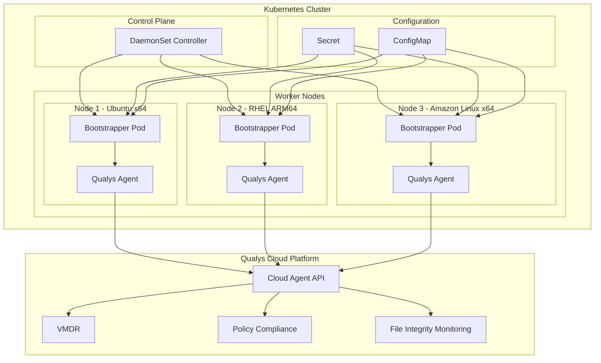
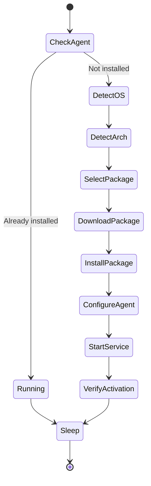
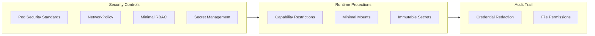

# Streamlining Kubernetes Security: Qualys Cloud Agent Helm Chart for Automated Node Protection

**Author:** Andrew Nelson, Senior Security Solutions Architect, Qualys

**Read Time:** 10 minutes

## Overview

Organizations running Kubernetes face a fundamental security gap: worker nodes require the same vulnerability management and compliance monitoring as traditional infrastructure, yet deploying and maintaining security agents across dynamic container orchestration platforms presents unique challenges. Existing approaches force security teams to choose between incomplete visibility from containerized agents, manual installation processes that cannot scale, or complex automation pipelines that require significant engineering investment.

The Qualys Cloud Agent Helm Chart eliminates these tradeoffs. Using a bootstrapper model, the Helm chart automatically installs and configures the Qualys Cloud Agent directly on Kubernetes worker nodes, delivering host-level visibility without manual intervention. This approach represents a fundamental shift in how organizations can secure their Kubernetes infrastructure, combining the operational simplicity of Helm with the comprehensive security capabilities of the Qualys Cloud Platform.

## The Kubernetes Security Visibility Gap

Before examining the solution, it is important to understand why traditional agent deployment methods fall short in Kubernetes environments.

### The Container Isolation Problem

Most security vendors attempt to run their agents inside containers. While this approach simplifies deployment through standard Kubernetes primitives, it creates a fundamental visibility limitation. Container isolation, the same mechanism that provides application security benefits, prevents agents from accessing host-level resources. Containerized agents cannot enumerate host processes, inspect kernel modules, audit system configurations, or detect vulnerabilities in the underlying operating system.

This limitation is not a minor inconvenience. When a critical vulnerability like CVE-2024-21626 (Leaky Vessels) affects container runtimes at the host level, containerized security agents may lack the access required to detect the vulnerability or verify remediation. Organizations discover their "comprehensive" container security solution has blind spots precisely when they need visibility most.

### The Manual Deployment Burden

The alternative to containerized agents is installing agents directly on nodes through traditional methods: configuration management tools, golden images, or manual installation. Each approach carries significant operational overhead.

Configuration management tools like Ansible, Puppet, or Chef require maintaining separate automation infrastructure alongside Kubernetes. Security teams must coordinate with platform teams to integrate agent deployment into existing workflows, manage credentials for node access, and handle the complexity of heterogeneous node configurations.

Golden image approaches bake the agent into node images during the build process. This method works until the agent requires updates, at which point organizations must rebuild images, update node pools, and coordinate rolling replacements across production clusters. The time between vulnerability disclosure and agent update deployment can stretch to weeks.

Manual installation does not scale. A security team that can maintain agents across a handful of nodes cannot keep pace with auto-scaling clusters that add and remove nodes based on workload demand.

### The Architecture Fragmentation Challenge

Modern Kubernetes deployments increasingly span multiple architectures. Organizations run x86_64 nodes for general workloads alongside ARM64 nodes for cost optimization or specialized compute requirements. Managed Kubernetes services from major cloud providers now offer ARM-based node pools at reduced cost, driving adoption of mixed-architecture clusters.

Security agents must support both architectures with appropriate packages. Organizations using manual deployment methods must maintain separate installation procedures for each architecture, doubling the operational burden. Many security vendors lack ARM64 support entirely, leaving organizations with incomplete coverage or forcing architecture-constrained deployment decisions.

## Why Existing Approaches Fall Short

Organizations have attempted various workarounds to address these challenges, but each introduces its own limitations.

### Privileged DaemonSets Without Host Installation

Some vendors deploy privileged containers that mount the host filesystem and attempt to perform security scanning from within the container. While this approach provides some host visibility, it remains subject to container runtime limitations. The agent process runs within the container's process namespace, limiting its ability to monitor host-level events or integrate with system services.

These solutions also create security concerns. A privileged container with full host filesystem access represents an attractive target for attackers. If compromised, the container provides direct access to the host without the protections that a properly installed host agent would provide.

### Sidecar and Init Container Patterns

Sidecar approaches run security agents alongside application containers within each pod. This pattern addresses application-level security but does nothing for node-level visibility. Organizations still need a separate solution for host security, resulting in multiple agents, multiple consoles, and fragmented security operations.

Init container patterns that attempt to install agents during pod initialization face timing challenges. The init container must complete before the main container starts, but agent installation may require downloading packages, running configuration scripts, and starting services. Any failure in this process blocks pod startup, creating availability concerns that discourage adoption.

### Third-Party Automation Pipelines

Some organizations build custom automation to deploy agents using Kubernetes operators or GitOps workflows. While technically feasible, this approach requires significant engineering investment. Security teams must develop, test, and maintain custom automation code. They must handle edge cases like node replacement, architecture detection, and package management across multiple Linux distributions.

This engineering burden diverts resources from core security activities. Organizations spend time maintaining deployment automation instead of analyzing vulnerabilities, investigating threats, or improving security posture.

## The Qualys Solution: Helm-Based Bootstrapper Model

The Qualys Cloud Agent Helm Chart takes a different approach. Rather than running the agent inside a container or requiring custom automation, the Helm chart deploys a bootstrapper that installs the Qualys Cloud Agent directly on the host operating system using standard Kubernetes primitives.



### How the Bootstrapper Model Works

The Helm chart deploys a DaemonSet that schedules a bootstrapper pod on each Linux node in the cluster. The bootstrapper performs the following operations:



1. The bootstrapper checks whether the Qualys Cloud Agent is already installed on the host
2. If not installed, it detects the host operating system (Ubuntu, Debian, RHEL, CentOS, Amazon Linux, CoreOS, SUSE)
3. It identifies the host architecture (x86_64 or ARM64)
4. Based on OS and architecture, it selects the appropriate package format (DEB or RPM) and architecture variant
5. Using nsenter, it executes installation commands directly in the host namespace
6. It configures the agent with credentials from Kubernetes secrets, setting appropriate file permissions
7. It starts the agent service and verifies successful activation with the Qualys platform
8. The bootstrapper enters a sleep state while the host agent provides continuous security coverage

This approach delivers the security benefits of host-level agent installation while leveraging Kubernetes for deployment automation.

### Automatic Scaling and Node Discovery

When Kubernetes adds nodes to the cluster through auto-scaling or manual expansion, the DaemonSet controller automatically schedules bootstrapper pods on new nodes. The agent installation process runs without operator intervention. Security coverage expands automatically as infrastructure scales.

When nodes are removed from the cluster, the agent installed on the host continues running until the node is terminated. There is no gap in coverage during node lifecycle transitions.

### Universal Distribution Support

The bootstrapper includes package detection and installation logic for major Linux distributions:

| Distribution | Package Format | Architectures |
|--------------|----------------|---------------|
| Ubuntu | DEB | x86_64, ARM64 |
| Debian | DEB | x86_64, ARM64 |
| Red Hat Enterprise Linux | RPM | x86_64, ARM64 |
| CentOS | RPM | x86_64, ARM64 |
| Amazon Linux | RPM | x86_64, ARM64 |
| Fedora CoreOS | RPM | x86_64, ARM64 |
| SUSE Linux Enterprise | RPM | x86_64, ARM64 |

Organizations running heterogeneous clusters with multiple Linux distributions receive consistent agent deployment across all nodes.

## Security Architecture

The Helm chart incorporates security controls aligned with CIS Kubernetes Benchmark recommendations and defense-in-depth principles.



### Network Isolation

The Helm chart deploys a NetworkPolicy that restricts pod egress to essential traffic only:

- HTTPS (TCP 443) for communication with the Qualys Cloud Platform
- DNS (UDP/TCP 53) for name resolution

All other outbound traffic is denied by default. This restriction limits the blast radius if the bootstrapper container were compromised, preventing lateral movement or data exfiltration to unauthorized destinations.

### Credential Protection

Qualys credentials (Activation ID and Customer ID) are stored in Kubernetes secrets marked as immutable. The bootstrapper reads credentials from mounted secret volumes and writes them to agent configuration files with mode 600 permissions, ensuring only the root user can read the credentials on the host.

Credential values are never logged. The bootstrapper redacts sensitive values from all output, preventing credential exposure through container logs or Kubernetes events.

### Minimal Privilege

The bootstrapper requires privileged access to install software on the host, but the Helm chart follows least-privilege principles in all other areas:

| Control | Implementation |
|---------|----------------|
| ServiceAccount Token | Automount disabled on both ServiceAccount and Pod |
| RBAC | Read-only access to nodes and pods for metadata collection |
| Capabilities | Drops ALL capabilities, adds only SYS_ADMIN, SYS_CHROOT, SYS_PTRACE |
| Host Network | Disabled; uses pod networking |
| Host Mounts | Specific paths only, not full filesystem access |

### Pod Security Standards

The namespace created by the Helm chart includes labels enforcing Pod Security Standards at the privileged level. This configuration is required for the bootstrapper to access host resources but is applied only to the dedicated Qualys namespace, not cluster-wide.

## Deployment

Installing the Qualys Cloud Agent across an entire Kubernetes cluster requires minimal configuration.

### Quick Start

```bash
helm repo add qualys https://nelssec.github.io/qualys-ca-helm
helm repo update

helm install qualys-agent qualys/qualys-ca \
  --namespace qualys \
  --create-namespace \
  --set credentials.activationId="YOUR_ACTIVATION_ID" \
  --set credentials.customerId="YOUR_CUSTOMER_ID" \
  --set config.serverUri="YOUR_PLATFORM_URL"
```

### Using Existing Secrets

Organizations with existing secret management workflows can create secrets separately:

```bash
kubectl create namespace qualys

kubectl create secret generic qualys-credentials \
  --namespace qualys \
  --from-literal=ACTIVATION_ID="YOUR_ACTIVATION_ID" \
  --from-literal=CUSTOMER_ID="YOUR_CUSTOMER_ID"

helm install qualys-agent qualys/qualys-ca \
  --namespace qualys \
  --set credentials.existingSecret="qualys-credentials" \
  --set config.serverUri="YOUR_PLATFORM_URL"
```

### Verification

After deployment, verify agent installation across all nodes:

```bash
# Check DaemonSet status
kubectl get daemonset -n qualys

# View bootstrapper logs
kubectl logs -n qualys -l app.kubernetes.io/name=qualys-ca

# Verify agent status on a specific node
kubectl exec -n qualys <pod-name> -- \
  nsenter --target 1 --mount --uts --ipc --net --pid -- \
  systemctl status qualys-cloud-agent
```

## Integration with Qualys Cloud Platform

Once installed, agents automatically connect to the Qualys Cloud Platform, providing immediate access to security capabilities.

### Vulnerability Management, Detection, and Response (VMDR)

Agents report installed packages and system configuration to VMDR, enabling:

- Continuous vulnerability assessment without scheduled scans
- Six-hour vulnerability detection SLA from CVE publication
- Prioritization based on asset criticality, exploit availability, and threat intelligence
- Automated remediation workflows through Qualys Patch Management integration

### Policy Compliance

Agents evaluate system configurations against compliance benchmarks:

- CIS Benchmarks for operating system hardening
- Custom policy definitions for organizational requirements
- Continuous monitoring with drift detection
- Evidence collection for audit documentation

### File Integrity Monitoring

Agents monitor critical files and directories for unauthorized changes:

- Real-time change detection with event forwarding
- Baseline management for authorized configuration states
- Integration with SIEM and SOAR platforms through Qualys APIs

## Technical Specifications

| Specification | Details |
|---------------|---------|
| Kubernetes Versions | 1.19 and later |
| Helm Versions | 3.0 and later |
| Supported Architectures | x86_64, ARM64 |
| Supported Operating Systems | Ubuntu, Debian, RHEL, CentOS, Amazon Linux, Fedora CoreOS, SUSE |
| Agent Version | Latest stable release |
| Update Strategy | Rolling update with configurable maxUnavailable |
| Resource Requests | 100m CPU, 128Mi memory |
| Resource Limits | 500m CPU, 512Mi memory |
| Priority Class | system-node-critical |

## Value Propositions

The Qualys Cloud Agent Helm Chart delivers measurable benefits across security, operations, and compliance functions.

### Eliminate Deployment Complexity

Organizations can deploy comprehensive vulnerability management across their entire Kubernetes infrastructure with a single Helm command. No configuration management integration, no golden image rebuilds, no custom automation development.

### Close the Host Visibility Gap

Unlike containerized agents that lack host access, the Qualys Cloud Agent runs directly on worker nodes with full visibility into operating system packages, configurations, and processes.

### Scale Automatically

Agent deployment scales with infrastructure. When auto-scaling adds nodes, agents install automatically. Security teams focus on analyzing findings rather than maintaining deployment automation.

### Unify Security Operations

Kubernetes worker nodes appear in the same Qualys console as traditional infrastructure. Security teams use familiar workflows, dashboards, and integrations without managing separate tools for container environments.

### Maintain Compliance Posture

Continuous agent-based assessment provides the evidence and documentation required for compliance audits. Organizations can demonstrate consistent security controls across dynamic Kubernetes environments.

## Get Started

### Current Qualys Subscribers

Deploy the Qualys Cloud Agent across your Kubernetes clusters today:

```bash
helm repo add qualys https://nelssec.github.io/qualys-ca-helm
helm install qualys-agent qualys/qualys-ca --namespace qualys --create-namespace
```

For detailed configuration options, visit the [Qualys Cloud Agent Helm Chart repository](https://github.com/nelssec/qualys-ca-helm).

### New to Qualys

Contact your Qualys representative or visit [qualys.com](https://www.qualys.com) to learn more about the Qualys Cloud Platform and start a free trial of VMDR.

## Resources

- [GitHub Repository](https://github.com/nelssec/qualys-ca-helm)
- [Artifact Hub](https://artifacthub.io/packages/helm/qualys-ca/qualys-ca)
- [Qualys Cloud Agent Documentation](https://www.qualys.com/documentation/qualys-cloud-agent/)
- [Qualys VMDR](https://www.qualys.com/apps/vulnerability-management-detection-response/)
